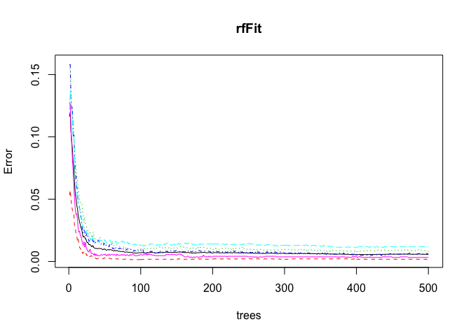
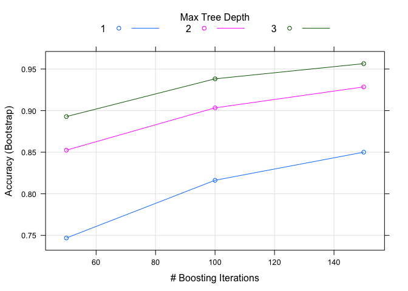

About the Project
-----------------

The main aim of this project is to quantify how well people perform
certain exercise activities. We use machine learning to predict the
manner in which they did exercise. Using devices such as Jawbone Up,
Nike FuelBand, and Fitbit it is now possible to collect a large amount
of data about personal activity relatively inexpensively. We use data
from accelorometer on the belt, forearm, arm and dumbbell of 6
participants.

Required R libraries
--------------------

    library(caret)

    ## Loading required package: lattice

    ## Loading required package: ggplot2

    library(rpart)
    library(rpart.plot)
    library(RColorBrewer)
    library(randomForest)

    ## randomForest 4.6-12

    ## Type rfNews() to see new features/changes/bug fixes.

    ## 
    ## Attaching package: 'randomForest'

    ## The following object is masked from 'package:ggplot2':
    ## 
    ##     margin

    library(knitr)
    library(doMC)

    ## Loading required package: foreach

    ## Loading required package: iterators

    ## Loading required package: parallel

Getting and loading data
------------------------

> The data for this project was provided by
> <http://groupware.les.inf.puc-rio.br/har>.

    trainUrl <- "http://d396qusza40orc.cloudfront.net/predmachlearn/pml-training.csv"
    testUrl <- "http://d396qusza40orc.cloudfront.net/predmachlearn/pml-testing.csv"

    training <- read.csv(url(trainUrl), na.strings=c("NA","#DIV/0!",""))
    testing <- read.csv(url(testUrl), na.strings=c("NA","#DIV/0!",""))

Cleaning data
-------------

In order for the machine learning algorithms to work, we have to remove
features which have null values. For this lets find null values percent
in each column and we will subset the data.

    naVal <- round(colMeans(is.na(training)), 2)
    index <- which(naVal==0)[-1]
    training <- training[, index]
    testing <- testing[, index]

Also the 1st 6 columns are not very useful for our analysis. Also making
all columns as numeric.

    training <- training[, -(1:6)]
    testing <- testing[, -(1:6)]
    for(i in 1:(length(training)-1)){
        training[,i] <- as.numeric(training[,i])
        testing[,i] <- as.numeric(testing[,i])
    }

Cross validation (Partitioning data)
------------------------------------

The training data is to be partioned into 2 parts: data to train a model
and data to test the model. I prefer partitioning at 60% for training
and remaining for testing.

    inTrain <- createDataPartition(training$classe, p=0.6, list=FALSE)
    myTraining <- training[inTrain, ]
    myTesting <- training[-inTrain, ]
    dim(myTraining); dim(myTesting)

    ## [1] 11776    53

    ## [1] 7846   53

Machine Learning Models
-----------------------

Lets now build the machine learning models using two widely used
algorithms.

### Random Forest

    registerDoMC(cores = 8)
    rfFit <- randomForest(classe~., data = myTraining , method ="rf", prox = TRUE)
    rfFit

    ## 
    ## Call:
    ##  randomForest(formula = classe ~ ., data = myTraining, method = "rf",      prox = TRUE) 
    ##                Type of random forest: classification
    ##                      Number of trees: 500
    ## No. of variables tried at each split: 7
    ## 
    ##         OOB estimate of  error rate: 0.56%
    ## Confusion matrix:
    ##      A    B    C    D    E class.error
    ## A 3342    3    2    0    1 0.001792115
    ## B   12 2261    6    0    0 0.007898201
    ## C    0    9 2042    3    0 0.005842259
    ## D    0    0   23 1907    0 0.011917098
    ## E    0    0    1    6 2158 0.003233256

    rfPred <- predict(rfFit, myTesting)
    confusionMatrix(rfPred, myTesting$classe)

    ## Confusion Matrix and Statistics
    ## 
    ##           Reference
    ## Prediction    A    B    C    D    E
    ##          A 2230   10    0    0    0
    ##          B    2 1503    6    0    0
    ##          C    0    5 1357   18    1
    ##          D    0    0    5 1264    9
    ##          E    0    0    0    4 1432
    ## 
    ## Overall Statistics
    ##                                           
    ##                Accuracy : 0.9924          
    ##                  95% CI : (0.9902, 0.9942)
    ##     No Information Rate : 0.2845          
    ##     P-Value [Acc > NIR] : < 2.2e-16       
    ##                                           
    ##                   Kappa : 0.9903          
    ##  Mcnemar's Test P-Value : NA              
    ## 
    ## Statistics by Class:
    ## 
    ##                      Class: A Class: B Class: C Class: D Class: E
    ## Sensitivity            0.9991   0.9901   0.9920   0.9829   0.9931
    ## Specificity            0.9982   0.9987   0.9963   0.9979   0.9994
    ## Pos Pred Value         0.9955   0.9947   0.9826   0.9890   0.9972
    ## Neg Pred Value         0.9996   0.9976   0.9983   0.9967   0.9984
    ## Prevalence             0.2845   0.1935   0.1744   0.1639   0.1838
    ## Detection Rate         0.2842   0.1916   0.1730   0.1611   0.1825
    ## Detection Prevalence   0.2855   0.1926   0.1760   0.1629   0.1830
    ## Balanced Accuracy      0.9987   0.9944   0.9941   0.9904   0.9962

As seen from the summary above the accuracy is 99%.

Lets now use another algorithm and verify its accuracy before deciding
the algorithm to use on test data.

### Generalized Boosted Regression Models

    gbmFit <- train(classe~., data = myTraining, method ="gbm", verbose = FALSE)

    ## Loading required package: gbm

    ## Loading required package: survival

    ## 
    ## Attaching package: 'survival'

    ## The following object is masked from 'package:caret':
    ## 
    ##     cluster

    ## Loading required package: splines

    ## Loaded gbm 2.1.3

    ## Loading required package: plyr

    gbmFit

    ## Stochastic Gradient Boosting 
    ## 
    ## 11776 samples
    ##    52 predictor
    ##     5 classes: 'A', 'B', 'C', 'D', 'E' 
    ## 
    ## No pre-processing
    ## Resampling: Bootstrapped (25 reps) 
    ## Summary of sample sizes: 11776, 11776, 11776, 11776, 11776, 11776, ... 
    ## Resampling results across tuning parameters:
    ## 
    ##   interaction.depth  n.trees  Accuracy   Kappa    
    ##   1                   50      0.7468484  0.6791245
    ##   1                  100      0.8162567  0.7674579
    ##   1                  150      0.8500119  0.8102175
    ##   2                   50      0.8524411  0.8130901
    ##   2                  100      0.9033155  0.8776093
    ##   2                  150      0.9284849  0.9094788
    ##   3                   50      0.8928478  0.8643371
    ##   3                  100      0.9382202  0.9218061
    ##   3                  150      0.9564564  0.9448969
    ## 
    ## Tuning parameter 'shrinkage' was held constant at a value of 0.1
    ## 
    ## Tuning parameter 'n.minobsinnode' was held constant at a value of 10
    ## Accuracy was used to select the optimal model using  the largest value.
    ## The final values used for the model were n.trees = 150,
    ##  interaction.depth = 3, shrinkage = 0.1 and n.minobsinnode = 10.

    gbmPred <- predict(gbmFit, myTesting)
    confusionMatrix(gbmPred, myTesting$classe)

    ## Confusion Matrix and Statistics
    ## 
    ##           Reference
    ## Prediction    A    B    C    D    E
    ##          A 2193   63    0    0    5
    ##          B   23 1408   40    4    6
    ##          C   11   42 1304   34   12
    ##          D    4    5   22 1235   26
    ##          E    1    0    2   13 1393
    ## 
    ## Overall Statistics
    ##                                           
    ##                Accuracy : 0.9601          
    ##                  95% CI : (0.9555, 0.9643)
    ##     No Information Rate : 0.2845          
    ##     P-Value [Acc > NIR] : < 2.2e-16       
    ##                                           
    ##                   Kappa : 0.9495          
    ##  Mcnemar's Test P-Value : 1.67e-08        
    ## 
    ## Statistics by Class:
    ## 
    ##                      Class: A Class: B Class: C Class: D Class: E
    ## Sensitivity            0.9825   0.9275   0.9532   0.9603   0.9660
    ## Specificity            0.9879   0.9885   0.9847   0.9913   0.9975
    ## Pos Pred Value         0.9699   0.9507   0.9294   0.9559   0.9886
    ## Neg Pred Value         0.9930   0.9827   0.9901   0.9922   0.9924
    ## Prevalence             0.2845   0.1935   0.1744   0.1639   0.1838
    ## Detection Rate         0.2795   0.1795   0.1662   0.1574   0.1775
    ## Detection Prevalence   0.2882   0.1888   0.1788   0.1647   0.1796
    ## Balanced Accuracy      0.9852   0.9580   0.9690   0.9758   0.9818

The accuracy of above algorithm is at 96%.

Let's plot the 2 models.

    plot(rfFit)

    plot(gbmFit)

We can apply the Random Forest model for the testing set.

    predict(rfFit, testing)

    ##  1  2  3  4  5  6  7  8  9 10 11 12 13 14 15 16 17 18 19 20 
    ##  B  A  B  A  A  E  D  B  A  A  B  C  B  A  E  E  A  B  B  B 
    ## Levels: A B C D E
