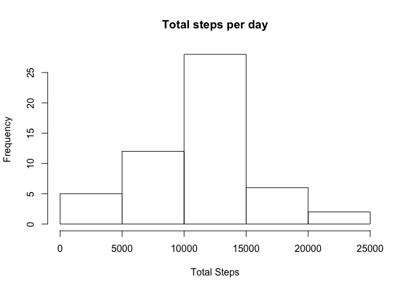
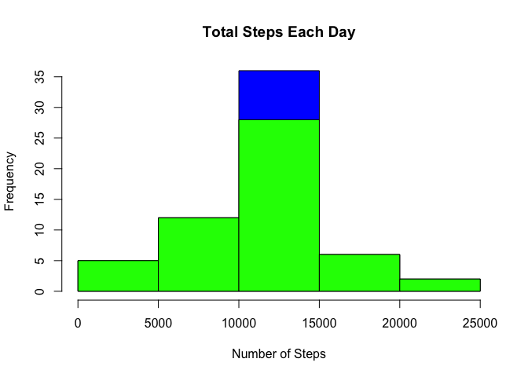

# Reproducible Research: Peer Assessment 1


## Loading and preprocessing the data

```r
#Reading data and removing null values.
if(!file.exists("activity.csv")) {
        temp <- tempfile()
        download.file("http://d396qusza40orc.cloudfront.net/repdata%2Fdata%2Factivity.zip",temp)
        unzip(temp)
        unlink(temp)
}

activityData <- read.csv("activity.csv")
cleanData <- activityData[!is.na(activityData$steps),]
paste(nrow(cleanData) , "data read into dataframe", sep = " ")
```

```
## [1] "15264 data read into dataframe"
```


## What is mean total number of steps taken per day?

```r
#Calculating steps per each day and putting data into a table with column names.
totalStepsPerDay <- aggregate(cleanData$steps ~ cleanData$date, FUN = sum)
colnames(totalStepsPerDay) <- c("Date", "TotalSteps")
#Plotting histogram for the data.
hist(totalStepsPerDay$TotalSteps, xlab = "Total Steps", main = "Total steps per day")
```

<!-- -->

```r
dev.print(png, "instructions_fig/plot1.png", width=640, height=640)
```

```
## quartz_off_screen 
##                 2
```

```r
dev.off()
```

```
## null device 
##           1
```

```r
#Calculating and displaying mean and median of data
meanOfSteps <- as.integer(mean(totalStepsPerDay$TotalSteps))
medianOfSteps <- as.integer(median(totalStepsPerDay$TotalSteps))
paste("Mean of number of steps per day was",meanOfSteps,sep = " ")
```

```
## [1] "Mean of number of steps per day was 10766"
```

```r
paste("Median of number of steps per day was",medianOfSteps,sep = " ")
```

```
## [1] "Median of number of steps per day was 10765"
```


## What is the average daily activity pattern?

```r
#Calculating average steps by interval and plotting.
stepsByInterval <- aggregate(steps ~ interval, cleanData, mean)
plot(stepsByInterval$interval,stepsByInterval$steps, type="l", xlab="Interval", ylab="Number of Steps",main="Average Number of Steps per Day by Interval")
```

<!-- -->

```r
dev.print(png, "instructions_fig/plot2.png", width=640, height=640)
```

```
## quartz_off_screen 
##                 2
```

```r
dev.off()
```

```
## null device 
##           1
```

```r
#Calculating the max number of steps in a 5 min interval and displaying.
max <- stepsByInterval[which.max(stepsByInterval$steps),1]
paste("The 5 min interval which contains the maximum # of steps is", max, sep = " ")
```

```
## [1] "The 5 min interval which contains the maximum # of steps is 835"
```


## Imputing missing values
### Imputing missing data was required. The steps column had NA values. The NAs for particular interval are replaced with mean of that interval in all days.

```r
incompleteData <- sum(!complete.cases(activityData))
imputedData <- transform(activityData, steps = ifelse(is.na(activityData$steps), stepsByInterval$steps[match(activityData$interval, stepsByInterval$interval)], activityData$steps))
stepsByIntervalNew <- aggregate(steps ~ date, imputedData, sum)
hist(stepsByIntervalNew$steps, main = paste("Total Steps Each Day"), col="blue", xlab="Number of Steps")
hist(totalStepsPerDay$TotalSteps, main = paste("Total Steps Each Day"), col="green", xlab="Number of Steps", add=T)
```

<!-- -->

```r
dev.print(png, "instructions_fig/plot3.png", width=640, height=640)
```

```
## quartz_off_screen 
##                 2
```

```r
dev.off()
```

```
## null device 
##           1
```

```r
newMean <- mean(stepsByIntervalNew$steps)
newMedian <- median(stepsByIntervalNew$steps)
diff <- sum(stepsByIntervalNew$steps) - sum(stepsByInterval$steps)
paste("Mean after imputting values", newMean, sep = " ")
```

```
## [1] "Mean after imputting values 10766.1886792453"
```

```r
paste("Median after imputting values", newMedian, sep = " ")
```

```
## [1] "Median after imputting values 10766.1886792453"
```

```r
paste("Difference because of imputtin", diff, sep = " ")
```

```
## [1] "Difference because of imputtin 645971.320754717"
```


## Are there differences in activity patterns between weekdays and weekends?

```r
daysOfWeek <- c("Monday", "Tuesday", "Wednesday", "Thursday", "Friday")
imputedData$dow <- as.factor(ifelse(is.element(weekdays(as.Date(imputedData$date)),daysOfWeek), "Weekday", "Weekend"))
stepsbyIntervalNew <- aggregate(steps ~ interval + dow, imputedData, mean)
library(lattice)
xyplot(stepsbyIntervalNew$steps ~ stepsbyIntervalNew$interval|stepsbyIntervalNew$dow, main="Average Steps per Day by Interval",xlab="Interval", ylab="Steps",layout=c(1,2), type="l")
```

<!-- -->

```r
dev.print(png, "instructions_fig/plot4.png", width=640, height=640)
```

```
## quartz_off_screen 
##                 2
```

```r
dev.off()
```

```
## null device 
##           1
```


### The overall activity on weekends is more. But there is a high peak earlier in weekdays.
